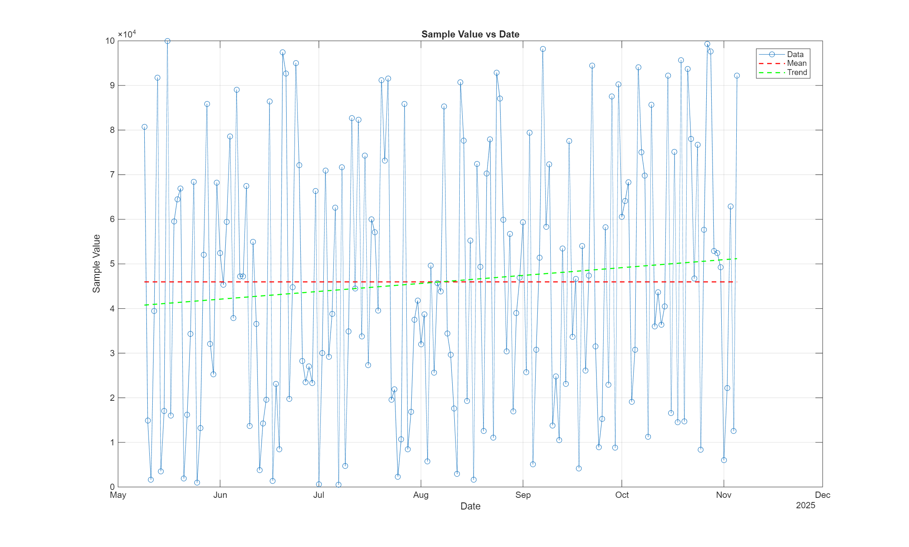
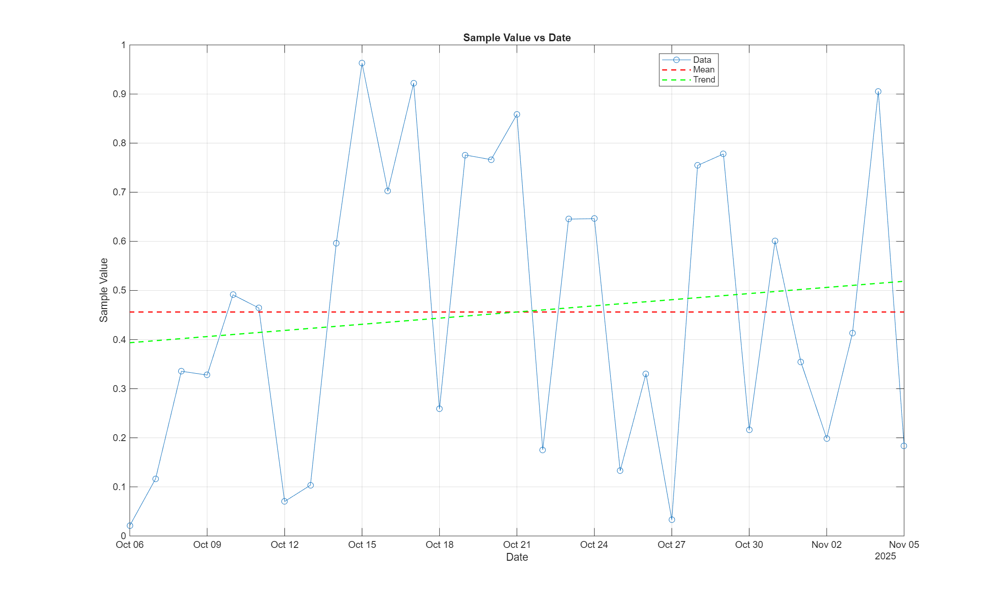
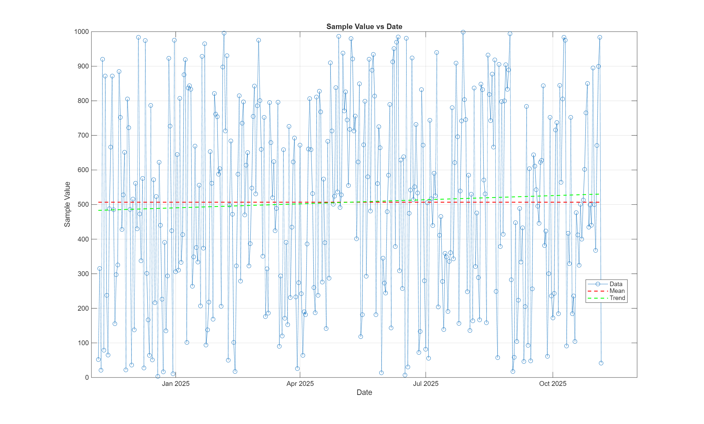
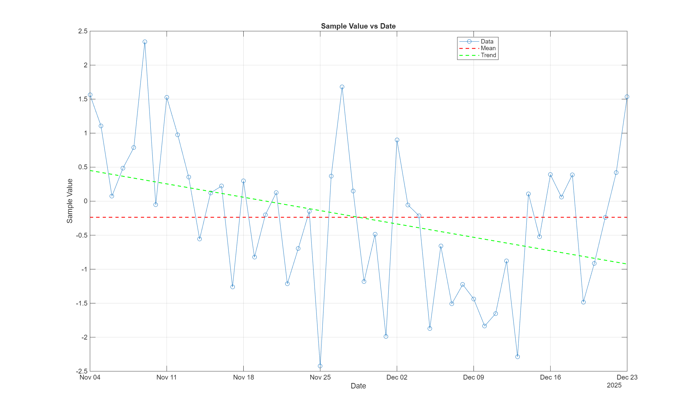

# MATLAB Interview Task (Mitek Analytics)
### *Artur Akopyan*
### *November 06, 2025*
# Project Description
MATLAB time series plotter with generated data and configurable trends - this project reads CSV datasets and config files to generate customixable plots with optimized mean lines, linear/ploy regressions, or Hodrick-Prescott filter trend smoothing. This code outputs a detailed labeled visualization (PNG) which shows the key data trends and patterns.

# Functionality Description
The main script is `task.m`
1. Reads datasets(change dataset to whichever one you want) and config file
2. Checks data formats are good
3. Plots the data, mean/trend lines
4. saves the output as plot_x (x being what dataset you choose from the three datasets)

# Test Data Generator
The script is `makeTestData.m`
1. This generates the test datasets as specified in the code which can be changed to what you desire
      - (`data_6months.csv`, `data_31days.csv`, `data_365days`)
3. You need to change the code accordingly to generate what you want
4. Supports random data or cosine-based noisy data
5. Assists in verifying trend and smoothing functionality

# Data Trending Algorithm
The function is `dataTrend.m` (we have this called in `task.m`)
1. Linear regression, using least-squares fit
2. 3rd order poly regression
3. Hodrick-Prescott Filter for nonparametric trend smoothing (we can set our lambda = 100000 for better smooth results on the noisy cosine data)

# Output
A PNG image called `plot.png` will be generated showing the visualization 

# User Instructions
Open MATLAB
1. Place these files in the same directory:
      - `task.m`
      - `makeTestData.m`
      - `dataTrend.m`
      -  make sure you have set the correctly directory for the data to be inputted into the folders
2. Edit the first lines of `task.m` to point to your data file:
      - data   = for example `data_365.csv`
      - config = for example `config.csv`
3. Run the script
4. Plot will show in window and save in the corrrect folder as `plot.png`, you can go ahead and rename the plot graph afterwards.

# Config File
The `config.csv` file defines how the plot should look:
  (key, value, comment)

  | **Key** | **Value Example** | **Description** |
|----------|------------------|-----------------|
| showMeanLine | 1 | Show (1) or hide (0) the red mean line |
| showTrendLine | 1 | Show (1) or hide (0) the green trend line |
| trendType | linear / poly3 / hp | Selects trend algorithm: • *linear* – straight regression • *poly3* – curved fit • *hp* – smoothed trend |
| xlabel | Date | Text label for x-axis |
| ylabel | Value | Text label for y-axis |

# Data Interface Specs
  ## Data file (inputs)
  1. Format : .csv
  2. Columns :
      - date = we check correct format in matlab
      - value = numberical value
  
  ## Config file (inputs)
  1. Format : .csv
  2. Columns :
      - key
      - value
      - comment
  3. Helps define which labels and lines to display on the plot
  
  ## Output
  1. Format : `plot.png` (.png)
  2. Description
      - Blue Line = raw data
      - Red Line = mean
      - Green Line = trend
      - Labels automatically applied

# Explanation of Results
## Example Plots

Below are example outputs generated using different datasets to demonstrate the project’s functionality.

---

### 6-Month Random Data (0–100000 Range)
  
*Shows random data with large variance over six months.  
The red dashed line indicates the mean value, and the green dashed line shows the linear trend increasing slightly over time.*

---

### 31-Day Random Data (0–1 Range)
  
*Short-term dataset with smaller fluctuations.  
The green trend line shows a gentle upward slope.*

---

### 1-Year Random Data (1–999 Range)
  
*Full-year dataset showing consistent random spread.  
The trend (green) and mean (red) lines demonstrate overall balance around the midpoint.*

---

### Cosine Function Data with Noise
  
*Cosine wave with added noise.  
The HP filter (green) produces a smooth trend capturing the underlying periodic shape,  
while the red mean line stays constant near zero.*

---

   
